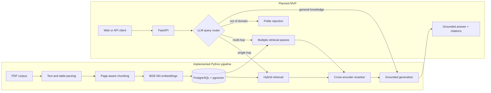

# FabRAG

FabRAG is a production-oriented Retrieval-Augmented Generation (RAG) project for electronics manufacturing documentation. It is designed to help engineers find grounded answers in component datasheets, equipment manuals, SOPs, work instructions, and public standards excerpts—with citations back to the source document and page.

> **Project status:** active development. Ingestion, hybrid retrieval, reranking,
> grounded generation, FastAPI, API hardening, retrieval evaluation, and an
> opt-in query router are implemented as a Python prototype. Stronger-model
> router validation, generation evaluation, web UI, CI/CD, and deployment remain.

## Why FabRAG?

Technical questions in electronics manufacturing often depend on exact values, package variants, operating conditions, and document revisions. Generic LLM answers are not reliable enough for that work. FabRAG is intended to combine:

- semantic retrieval for concept-level matches;
- keyword search for exact part numbers and specification codes;
- reranking for better context selection;
- page-aware citations for traceability; and
- an LLM router that can choose between single-hop retrieval, multi-hop comparison, general knowledge, or an out-of-domain rejection.

The project is also a practical study of the LLM application layer: ingestion, retrieval, routing, evaluation, deployment, and observability.

## Current capabilities

- A starter corpus of 50 public component datasheets from STMicroelectronics and Texas Instruments.
- PDF text and table extraction with `pdfplumber`.
- Overlapping fixed-size chunking while preserving source page spans.
- Normalized embeddings with `BAAI/bge-m3` through Sentence Transformers.
- Idempotent ingestion into PostgreSQL with `pgvector`.
- Document, chunk, embedding-model, and chunking-strategy metadata.
- PostgreSQL full-text and vector-ready schema.
- Unit tests for chunk sizing, overlap, page tracking, and validation.
- Docker Compose setup for the local PostgreSQL/pgvector service.
- Weighted reciprocal-rank fusion of vector and PostgreSQL full-text results.
- Cross-encoder reranking with `BAAI/bge-reranker-base`.
- Local evidence-only answer generation with source IDs such as `[S1]`.
- A typed FastAPI endpoint returning answers plus structured source metadata.
- An opt-in structured-output router with single-hop, multi-hop, general-knowledge,
  and out-of-domain branches. It defaults off until a stronger model is evaluated.
- A minimal browser client and authenticated thumbs-up/down feedback capture.

## Architecture

The ingestion and core RAG paths are implemented today as Python modules. The API and routing layer shown below remains the target MVP architecture.



The planned services are independently deployable:

- **Ingestion worker:** parse, chunk, embed, and store documents asynchronously.
- **API:** route questions, retrieve and rerank evidence, then return cited answers.
- **LLM server:** serve routing and generation separately so the model runtime can be scaled or replaced without changing the API.

## Repository layout

```text
FabRAG/
├── api-service/                    # FastAPI boundary for online questions
│   ├── fabrag_api/main.py          # Health and grounded-answer endpoints
│   └── tests/                      # HTTP contract tests with a mocked pipeline
├── evaluation/                     # Offline retrieval/reranking metrics
│   ├── fabrag_eval/evaluate.py      # JSONL loader, recall@k, and MRR runner
│   └── questions.example.jsonl     # Format example; not a reviewed benchmark
├── datasheets/                    # 50-document starter corpus
├── ingestion-worker/
│   ├── src/
│   │   ├── parse.py               # PDF text and table extraction
│   │   ├── chunk.py               # Fixed-size overlapping chunks
│   │   ├── embed.py               # Sentence Transformer embeddings
│   │   ├── db.py                  # SQLAlchemy models and DB helpers
│   │   ├── ingest.py              # End-to-end ingestion CLI
│   │   ├── retrieve.py            # pgvector semantic retrieval
│   │   ├── hybrid_retrieve.py     # Vector + full-text rank fusion
│   │   ├── rerank.py              # Cross-encoder candidate reranking
│   │   ├── answer.py              # Local grounded generation
│   │   └── schema.sql             # PostgreSQL + pgvector schema
│   ├── tests/
│   └── pyproject.toml
├── scripts/
│   └── bulk_download.py           # Corpus collection helper
├── .env.example
├── docker-compose.yml
└── CLAUDE.md                      # Product scope and engineering brief
```

## Quick start

### Prerequisites

- Python 3.11 or newer
- Docker with Docker Compose
- Git
- Enough RAM and disk space to run `BAAI/bge-m3`
- Internet access on the first run so Sentence Transformers can download the embedding model

### 1. Clone and configure

```bash
git clone https://github.com/thanhthanhhp123/FabRAG.git
cd FabRAG
cp .env.example .env
```

On Windows PowerShell, replace the last command with:

```powershell
Copy-Item .env.example .env
```

The example credentials are intended for local development only. Change them before exposing PostgreSQL beyond your machine.

### 2. Start PostgreSQL with pgvector

```bash
docker compose up -d postgres
docker compose ps
```

`ingestion-worker/src/schema.sql` is applied automatically when the database volume is created for the first time.

### 3. Install the ingestion worker

```bash
cd ingestion-worker
python -m venv .venv
```

Activate the environment:

```bash
# macOS/Linux
source .venv/bin/activate
```

```powershell
# Windows PowerShell
.venv\Scripts\Activate.ps1
```

Then install the package and development tools:

```bash
python -m pip install --upgrade pip
python -m pip install -e ".[dev]"
```

### 4. Ingest documents

Ingest a single datasheet:

```bash
python -m src.ingest ../datasheets/16_LM358_datasheet.pdf
```

Ingest the complete starter corpus:

```bash
python -m src.ingest --all
```

Re-ingesting a file replaces its existing chunks, which makes experiments with chunk sizes or embedding models repeatable without accumulating stale rows.

The first ingestion run may take substantially longer because it downloads and loads the embedding model. Processing all 50 PDFs is CPU- and memory-intensive.

When PyTorch can see CUDA, BGE-M3 embeddings, cross-encoder reranking, and local
Qwen generation use the GPU automatically. For Docker-based model runs, verify
the NVIDIA Container Toolkit before starting a long ingestion:

```bash
docker run --rm --gpus all nvidia/cuda:12.8.1-base-ubuntu22.04 nvidia-smi
python -c "import torch; print(torch.__version__, torch.cuda.is_available())"
```

The CUDA version shown by `nvidia-smi` is the driver's supported version; the
PyTorch wheel may use an older compatible CUDA runtime. CPU PyTorch remains a
valid fallback, but it is substantially slower for BGE-M3 on this corpus.

### 5. Inspect the result

From the repository root:

```bash
docker compose exec postgres psql -U fabrag -d fabrag -c \
  "SELECT d.filename, COUNT(c.id) AS chunks FROM documents d LEFT JOIN chunks c ON c.document_id = d.id GROUP BY d.id ORDER BY d.filename;"
```

## Configuration

Copy `.env.example` to `.env` and adjust these values as needed:

| Variable | Default | Purpose |
|---|---:|---|
| `POSTGRES_USER` | `fabrag` | Local PostgreSQL user |
| `POSTGRES_PASSWORD` | `fabrag` | Local PostgreSQL password |
| `POSTGRES_DB` | `fabrag` | Local database name |
| `DATABASE_URL` | `postgresql+psycopg://...` | SQLAlchemy connection URL used by the ingestion worker |
| `EMBEDDING_MODEL` | `BAAI/bge-m3` | Sentence Transformer model used for indexing |
| `EMBEDDING_DIM` | `1024` | Vector size expected by the database schema |
| `EMBEDDING_BATCH_SIZE` | `16` | Embedding batch; lower it if long chunks exhaust GPU memory |
| `CHUNK_SIZE_TOKENS` | `400` | Approximate chunk window; currently implemented as words |
| `CHUNK_OVERLAP_TOKENS` | `50` | Approximate overlap; currently implemented as words |
| `FABRAG_API_KEY` | none | Required `X-API-Key` secret for answer requests |
| `FABRAG_RATE_LIMIT_REQUESTS` | `30` | Requests allowed per API key and window |
| `FABRAG_RATE_LIMIT_WINDOW_SECONDS` | `60` | In-memory rate-limit window length |
| `FABRAG_ROUTER_ENABLED` | `false` | Enable experimental LLM routing and multi-hop orchestration |

Changing the embedding model or dimension requires a full re-index. If the vector dimension changes, update both `.env` and `ingestion-worker/src/schema.sql` before creating the database schema.

## Development

Run the tests and static checks from `ingestion-worker/`:

```bash
pytest
ruff check src tests
ruff format --check src tests
```

You can also inspect PDF extraction without connecting to PostgreSQL:

```bash
python -m src.parse ../datasheets/16_LM358_datasheet.pdf
```

### Run the API prototype

The API currently imports the retrieval/generation pipeline from the ingestion
worker. Install both packages into the same Python 3.11+ environment:

```bash
cd api-service
python -m venv .venv
source .venv/bin/activate
python -m pip install -e ../ingestion-worker -e ".[dev]"
export FABRAG_API_KEY='replace-with-a-long-random-secret'
uvicorn fabrag_api.main:app --host 127.0.0.1 --port 8000
```

The process-level health endpoint does not load models or query PostgreSQL:

```bash
curl http://127.0.0.1:8000/health
```

Open `http://127.0.0.1:8000/` for the minimal browser client. It asks for the API
key on each page load and does not save it in browser storage.

Submit a grounded question after `DATABASE_URL` is configured and the embedding,
reranker, and generation models are available:

```bash
curl -X POST http://127.0.0.1:8000/v1/answers \
  -H 'Content-Type: application/json' \
  -H "X-API-Key: $FABRAG_API_KEY" \
  -H 'X-Request-ID: demo_request_001' \
  -d '{"question":"What is the L293 supply voltage range?","candidate_k":10,"top_n":3}'
```

The response contains `answer` text, the selected `route`, and a `sources` array with stable IDs,
filename, page span, chunk index, and retrieval/reranker metadata. Every response
also includes `X-Request-ID`; a valid client-supplied value is preserved, otherwise
the server generates one. Access logs are JSON and contain request metadata but
not the API key or question body.

The built-in fixed-window limiter is per process. It is useful for a single-worker
development deployment, but counters are not shared across workers or replicas.
Use Redis or an API gateway before horizontal or public deployment.

Each answer also has a UUID `answer_id`. Submit a rating with:

```bash
curl -X POST http://127.0.0.1:8000/v1/feedback \
  -H 'Content-Type: application/json' \
  -H "X-API-Key: $FABRAG_API_KEY" \
  -d '{"answer_id":"<uuid-from-answer>","rating":"up"}'
```

For an existing database volume, apply the new `feedback` table from
`ingestion-worker/src/schema.sql`; Docker initialization scripts only run for a
new volume.

The Docker initialization script only runs against a new database volume. When the schema changes, apply the migration manually or recreate the local development volume if its data is disposable.

## Evaluation plan

The MVP will be evaluated with a manually reviewed set of 30–50 questions covering router decisions, single-hop lookup, multi-document comparison, general knowledge, and out-of-domain requests.

The initial offline harness accepts one JSON object per line. Each question must
have a unique ID, a reference answer, and at least one relevant filename; add a
one-based page when the evidence page has been reviewed:

```json
{"id":"l293-voltage","question":"What is the L293 supply voltage range?","reference_answer":"The range is 4.5 V to 36 V.","expected_sources":[{"filename":"32_L293_datasheet.pdf","page":1}]}
```

Install the evaluation package and ingestion worker in the same Python 3.11+
environment, then run against an actual reviewed file:

```bash
cd evaluation
python -m pip install -e ../ingestion-worker -e ".[dev]"
fabrag-evaluate questions.reviewed.jsonl --candidate-k 10 --top-n 5
```

The JSON output reports candidate recall@k/MRR and reranked recall@n/MRR. The
committed `questions.example.jsonl` demonstrates the schema only; it is not a
reviewed benchmark and must not be used to claim project quality.

`questions.verified.seed.jsonl` contains 10 facts checked directly against the
committed PDF text and page numbers. It is an auditable seed across 10 documents,
not the final 30–50 question benchmark; obtain independent human sign-off and add
harder/multi-document questions before publishing quality claims.

The first end-to-end seed run over 10 ingested documents and 383 chunks produced
candidate recall@10 `1.0`, candidate MRR `0.425`, reranked recall@5 `1.0`, and
reranked MRR `0.5117`. Treat these as development baseline values only: the seed
is small, fact-oriented, and not independently reviewed.

After ingesting all 50 starter documents (5,646 chunks), an initial GPU-backed
run exposed an incomplete LM317 relevance label: page 1 contains the reviewed
answer but only page 6 was accepted. After directly verifying and adding page 1
as valid evidence, the corrected run produced candidate recall@10 `1.0`,
candidate MRR `0.5511`, reranked recall@5 `1.0`, and reranked MRR `0.5417` in
37.519 seconds. The pre-audit result and diagnosis remain recorded in
`PROGRESS.md` rather than being silently replaced.

Planned metrics:

- router classification accuracy;
- retrieval recall@k and mean reciprocal rank (MRR);
- fixed-size versus heading-aware chunking;
- hybrid retrieval with and without reranking; and
- RAGAS faithfulness and answer relevancy.

Results will be reported as measured values rather than estimated product-impact claims.

## Roadmap

- [x] Define the product scope and architecture.
- [x] Collect a 50-document starter corpus.
- [x] Implement PDF parsing, fixed-size chunking, embedding, and storage.
- [x] Add an initial chunking test suite.
- [ ] Add semantic/heading-aware chunking.
- [x] Implement vector + keyword hybrid retrieval and reranking.
- [x] Build an opt-in structured-output query router and multi-hop orchestrator.
- [x] Add an initial cited answer-generation path and no-evidence fallback.
- [x] Expose the core answer path through an initial FastAPI service.
- [x] Add API-key authentication and a single-process rate-limit baseline.
- [x] Add a minimal web interface and feedback capture.
- [x] Build the initial offline retrieval/reranking evaluation harness.
- [ ] Review the benchmark questions and publish measured results.
- [x] Add request IDs and structured JSON access logs.
- [ ] Add shared rate limiting, CI/CD, and deployment.

## Data and responsible use

The starter corpus contains publicly available manufacturer datasheets. Copyright and trademarks remain with their respective owners. Do not add or redistribute paid IPC standards, private SOPs, confidential work instructions, or other restricted documents without permission.

FabRAG is an engineering information-retrieval project, not a substitute for checking the latest official document revision or completing the review and validation required for manufacturing decisions.

## Contributing

Keep configuration in environment variables and never commit secrets or local `.env` files. Changes to retrieval, chunking, reranking, or prompts should include before/after evaluation results once the evaluation harness is available.
